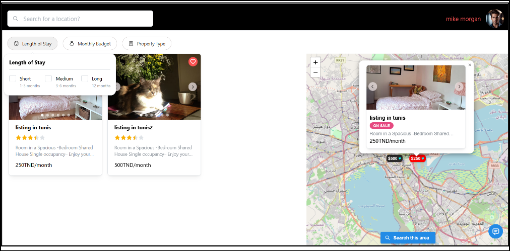
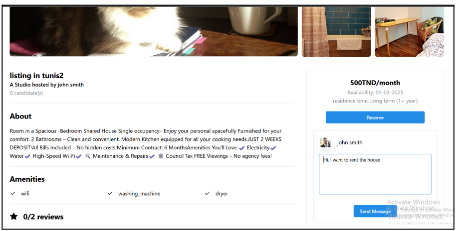

# A Platform for Renting and Managing Houses Online

## Intro

This project was developed as part of a final-year project for the completion of a Bachelor’s degree in Software Engineering at the faculty of sciences of monastir.

The modern rental market requires seamless, user-friendly solutions. This project provides an
application designed to help people search for housing, communicate with property owners, and
manage bookings efficiently.
The platform is a full-stack web application built with a microservice-oriented backend using
Node.js (Fastify) and a responsive React-based frontend. It uses MongoDB Atlas for data
persistence and integrates third-party services like MailerSend for email communication and
Geoapify for geographic features.

## Usage

1. Clone the repo

2. Change to the Repo folder

3. Install dependencies: ` npm install `

4. Run the development server: ` npm start ` 

## Note

1. API Keys: You must provide your own for services (Gemini AI, MailSender,Geoapify)

2. Database: MongoDB Atlas account required and the mongo URI 

## License

This project is licensed under the MIT license. See the [LICENSE](./License) file for more info.
